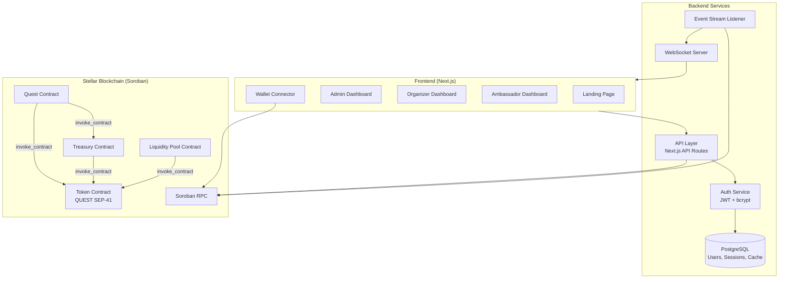
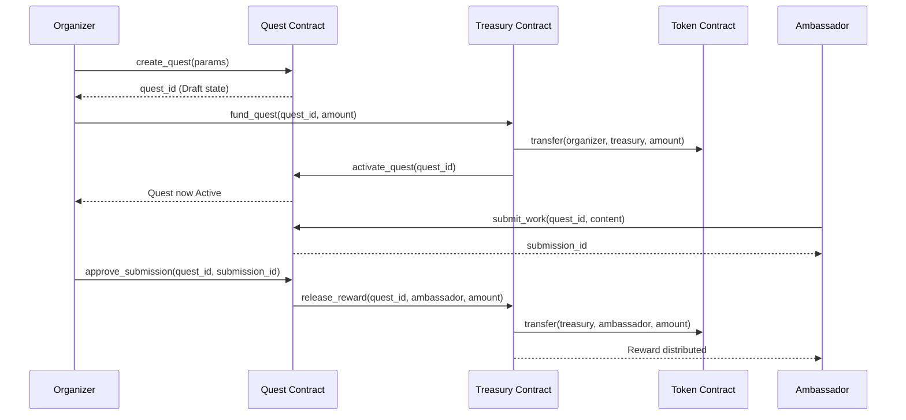
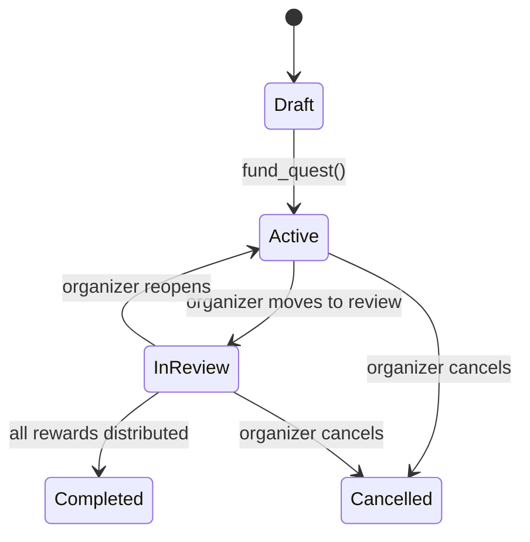

# Design Document: Quest@Stellar

## Overview

Quest@Stellar is a decentralized bounty and ambassador marketplace on the Stellar blockchain. The system consists of four Soroban smart contracts (Quest, Treasury, Token, Liquidity Pool) written in Rust, a Next.js frontend with premium UI, a backend auth service, and real-time Stellar event streaming.

The architecture follows a modular multi-contract pattern where each contract has a single responsibility. The Quest contract manages quest lifecycle and submissions. The Treasury contract handles fund locking, reward distribution, and refunds. The Token contract implements the QUEST token per SEP-41. The Liquidity Pool contract provides a constant-product AMM for QUEST ↔ XLM swaps.

The frontend uses Next.js with TypeScript, Tailwind CSS for the design system (gradients, glassmorphism, animations), and `@creit.tech/stellar-wallets-kit` for wallet connectivity. Authentication is email/password via a backend service with JWT sessions. Real-time updates come from Stellar event streaming via the Soroban RPC.

**Key Design Decisions:**
- **Modular contracts over monolith**: Each contract is independently deployable and testable. Cross-contract calls use Soroban's `env.invoke_contract()` pattern.
- **Email/password auth + optional wallet**: Users don't need a wallet to browse. Wallet connection is required only for on-chain transactions.
- **Next.js App Router**: Server-side rendering for the landing page (performance), client-side for dashboards (interactivity).
- **Soroban storage for contract state**: Quest and submission data lives on-chain. Off-chain database stores user profiles, auth data, and cached analytics.

## Architecture



### Contract Interaction Flow



## Components and Interfaces

### 1. Quest Contract (Soroban/Rust)

Manages quest lifecycle, submissions, and state transitions.

```rust
#[contractimpl]
impl QuestContract {
    /// Create a new quest in Draft state
    fn create_quest(
        env: Env,
        organizer: Address,
        title: String,
        description: String,
        acceptance_criteria: String,
        reward_type: RewardType,  // Fixed or Split
        reward_amount: i128,
        max_winners: u32,         // 1 for Fixed, >1 for Split
        deadline: u64,
    ) -> u64; // quest_id

    /// Transition quest state (called by organizer or treasury)
    fn transition_state(
        env: Env,
        quest_id: u64,
        caller: Address,
        new_state: QuestState,
    ) -> Result<(), QuestError>;

    /// Submit work for an active quest
    fn submit_work(
        env: Env,
        quest_id: u64,
        ambassador: Address,
        content: String,
    ) -> Result<u64, QuestError>; // submission_id

    /// Approve a submission (triggers reward via Treasury)
    fn approve_submission(
        env: Env,
        quest_id: u64,
        submission_id: u64,
        organizer: Address,
    ) -> Result<(), QuestError>;

    /// Reject a submission
    fn reject_submission(
        env: Env,
        quest_id: u64,
        submission_id: u64,
        organizer: Address,
    ) -> Result<(), QuestError>;

    // Read-only
    fn get_quest(env: Env, quest_id: u64) -> Option<Quest>;
    fn get_submissions(env: Env, quest_id: u64) -> Vec<Submission>;
    fn get_quest_state(env: Env, quest_id: u64) -> Option<QuestState>;
}
```

### 2. Treasury Contract (Soroban/Rust)

Manages fund locking, reward distribution, and refunds.

```rust
#[contractimpl]
impl TreasuryContract {
    /// Lock funds for a quest bounty pool
    fn fund_quest(
        env: Env,
        quest_id: u64,
        organizer: Address,
        amount: i128,
    ) -> Result<(), TreasuryError>;

    /// Release reward to an ambassador
    fn release_reward(
        env: Env,
        quest_id: u64,
        ambassador: Address,
        amount: i128,
    ) -> Result<(), TreasuryError>;

    /// Refund undistributed funds to organizer
    fn refund(
        env: Env,
        quest_id: u64,
        organizer: Address,
    ) -> Result<i128, TreasuryError>; // refunded amount

    // Read-only
    fn get_bounty_pool(env: Env, quest_id: u64) -> BountyPool;
}
```

### 3. Token Contract (Soroban/Rust — SEP-41)

Implements the QUEST token following the [Stellar SEP-41 token interface](https://developers.stellar.org/docs/tokens/token-interface).

```rust
#[contractimpl]
impl TokenContract {
    fn initialize(env: Env, admin: Address, name: String, symbol: String, decimal: u32, max_supply: i128);

    // SEP-41 interface
    fn allowance(env: Env, from: Address, spender: Address) -> i128;
    fn approve(env: Env, from: Address, spender: Address, amount: i128, expiration_ledger: u32);
    fn balance(env: Env, id: Address) -> i128;
    fn transfer(env: Env, from: Address, to: Address, amount: i128);
    fn transfer_from(env: Env, spender: Address, from: Address, to: Address, amount: i128);
    fn name(env: Env) -> String;
    fn symbol(env: Env) -> String;
    fn decimals(env: Env) -> u32;

    // Admin operations
    fn mint(env: Env, to: Address, amount: i128) -> Result<(), TokenError>;
    fn burn(env: Env, from: Address, amount: i128) -> Result<(), TokenError>;
    fn total_supply(env: Env) -> i128;
}
```

### 4. Liquidity Pool Contract (Soroban/Rust)

Constant-product AMM for QUEST ↔ XLM swaps.

```rust
#[contractimpl]
impl LiquidityPoolContract {
    fn initialize(
        env: Env,
        token_quest: Address,
        token_xlm: Address,
        swap_fee_bps: u32,        // basis points (e.g., 30 = 0.3%)
        max_slippage_bps: u32,
        min_liquidity: i128,
    );

    /// Swap token_in for token_out
    fn swap(
        env: Env,
        user: Address,
        token_in: Address,
        amount_in: i128,
        min_amount_out: i128,
    ) -> Result<i128, PoolError>; // amount_out

    /// Add liquidity, receive LP tokens
    fn deposit(
        env: Env,
        user: Address,
        amount_quest: i128,
        amount_xlm: i128,
    ) -> Result<i128, PoolError>; // lp_tokens_minted

    /// Remove liquidity, burn LP tokens
    fn withdraw(
        env: Env,
        user: Address,
        lp_amount: i128,
    ) -> Result<(i128, i128), PoolError>; // (quest_returned, xlm_returned)

    // Read-only
    fn get_reserves(env: Env) -> (i128, i128);
    fn get_spot_price(env: Env, token_in: Address) -> i128;
}
```

### 5. Auth Service (Backend)

```typescript
interface AuthService {
  register(email: string, password: string, role: UserRole): Promise<User>;
  login(email: string, password: string): Promise<{ token: string; user: User }>;
  verifyToken(token: string): Promise<TokenPayload>;
  logout(token: string): Promise<void>;
  refreshToken(token: string): Promise<string>;
}

interface RateLimiter {
  checkLimit(email: string): Promise<boolean>; // true if allowed
  recordFailedAttempt(email: string): Promise<void>;
  resetAttempts(email: string): Promise<void>;
}
```

### 6. Frontend Components

- **WalletProvider**: Wraps `@creit.tech/stellar-wallets-kit` for Freighter and other wallet connections
- **AuthProvider**: React context for JWT session management
- **EventStreamProvider**: WebSocket connection for real-time Stellar events
- **DashboardLayout**: Role-based layout with sidebar navigation
- **QuestExplorer**: Filterable, searchable quest listing for ambassadors
- **QuestForm**: Quest creation/editing form for organizers
- **SubmissionReview**: Submission list with approve/reject actions
- **SwapInterface**: Token swap UI with price impact display
- **LiquidityPanel**: Deposit/withdraw liquidity UI

### 7. Event Stream Listener (Backend)

Connects to Soroban RPC, listens for contract events, and pushes updates via WebSocket.

```typescript
interface EventStreamListener {
  subscribe(contractId: string, eventTypes: string[]): void;
  onEvent(handler: (event: StellarEvent) => void): void;
  reconnect(): Promise<void>;
  resync(fromLedger: number): Promise<StellarEvent[]>;
}
```

## Data Models

### On-Chain (Soroban Storage)

```rust
#[contracttype]
#[derive(Clone, Debug, PartialEq)]
pub enum QuestState {
    Draft,
    Active,
    InReview,
    Completed,
    Cancelled,
}

#[contracttype]
#[derive(Clone, Debug, PartialEq)]
pub enum RewardType {
    Fixed,
    Split,
}

#[contracttype]
#[derive(Clone, Debug, PartialEq)]
pub struct Quest {
    pub id: u64,
    pub organizer: Address,
    pub title: String,
    pub description: String,
    pub acceptance_criteria: String,
    pub reward_type: RewardType,
    pub reward_amount: i128,
    pub max_winners: u32,
    pub deadline: u64,
    pub state: QuestState,
    pub created_at: u64,
    pub approved_count: u32,
}

#[contracttype]
#[derive(Clone, Debug, PartialEq)]
pub enum SubmissionStatus {
    Pending,
    Approved,
    Rejected,
}

#[contracttype]
#[derive(Clone, Debug, PartialEq)]
pub struct Submission {
    pub id: u64,
    pub quest_id: u64,
    pub ambassador: Address,
    pub content: String,
    pub status: SubmissionStatus,
    pub submitted_at: u64,
}

#[contracttype]
#[derive(Clone, Debug, PartialEq)]
pub struct BountyPool {
    pub quest_id: u64,
    pub total_funded: i128,
    pub distributed: i128,
    pub organizer: Address,
}

#[contracttype]
#[derive(Clone, Debug, PartialEq)]
pub struct PoolReserves {
    pub quest_reserve: i128,
    pub xlm_reserve: i128,
    pub total_lp_supply: i128,
    pub swap_fee_bps: u32,
    pub max_slippage_bps: u32,
    pub min_liquidity: i128,
}
```

### Off-Chain (PostgreSQL)

```sql
CREATE TABLE users (
    id UUID PRIMARY KEY DEFAULT gen_random_uuid(),
    email VARCHAR(255) UNIQUE NOT NULL,
    password_hash VARCHAR(255) NOT NULL,
    salt VARCHAR(255) NOT NULL,
    role VARCHAR(20) NOT NULL CHECK (role IN ('admin', 'organizer', 'ambassador')),
    wallet_address VARCHAR(56),
    is_banned BOOLEAN DEFAULT FALSE,
    reputation_score INTEGER DEFAULT 0,
    created_at TIMESTAMP DEFAULT NOW(),
    updated_at TIMESTAMP DEFAULT NOW()
);

CREATE TABLE sessions (
    id UUID PRIMARY KEY DEFAULT gen_random_uuid(),
    user_id UUID REFERENCES users(id),
    token_hash VARCHAR(255) NOT NULL,
    expires_at TIMESTAMP NOT NULL,
    created_at TIMESTAMP DEFAULT NOW()
);

CREATE TABLE login_attempts (
    email VARCHAR(255) NOT NULL,
    attempted_at TIMESTAMP DEFAULT NOW(),
    success BOOLEAN NOT NULL
);

CREATE TABLE disputes (
    id UUID PRIMARY KEY DEFAULT gen_random_uuid(),
    submission_id BIGINT NOT NULL,
    quest_id BIGINT NOT NULL,
    ambassador_id UUID REFERENCES users(id),
    reason TEXT NOT NULL,
    admin_id UUID REFERENCES users(id),
    resolution VARCHAR(20) CHECK (resolution IN ('pending', 'ambassador_wins', 'organizer_wins')),
    created_at TIMESTAMP DEFAULT NOW(),
    resolved_at TIMESTAMP
);

CREATE TABLE failed_transactions (
    id UUID PRIMARY KEY DEFAULT gen_random_uuid(),
    tx_type VARCHAR(50) NOT NULL,
    user_id UUID REFERENCES users(id),
    error_details TEXT NOT NULL,
    quest_id BIGINT,
    amount BIGINT,
    retry_count INTEGER DEFAULT 0,
    status VARCHAR(20) DEFAULT 'pending',
    created_at TIMESTAMP DEFAULT NOW()
);
```

### Valid Quest State Transitions



